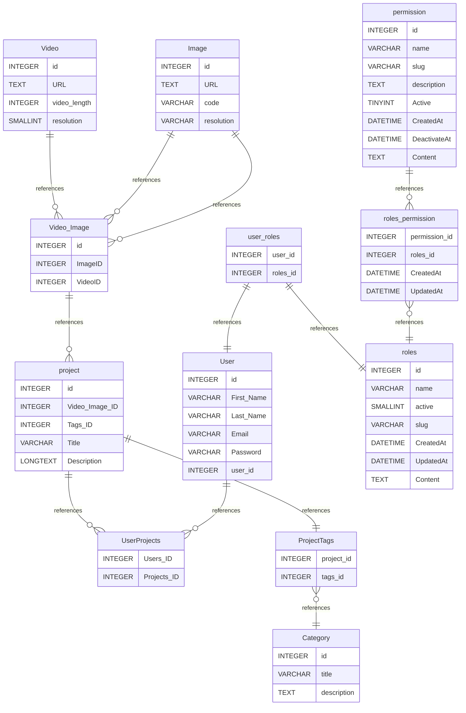

```mermaid
erDiagram
	project ||--o{ UserProjects : references
	User ||--o{ UserProjects : references
	Video ||--o{ Video_Image : references
	Image ||--o{ Video_Image : references
	Video_Image ||--o{ project : references
	project ||--|| ProjectTags : references
	ProjectTags }o--|| Category : references
	user_roles ||--|| User : references
	user_roles ||--|| roles : references
	permission ||--o{ roles_permission : references
	roles_permission }o--|| roles : references
	Image ||--o{ Video_Image : references

	project {
		INTEGER id
		INTEGER Video_Image_ID
		INTEGER Tags_ID
		VARCHAR Title
		LONGTEXT Description
	}

	User {
		INTEGER id
		VARCHAR First_Name
		VARCHAR Last_Name
		VARCHAR Email
		VARCHAR Password
		INTEGER user_id
	}

	UserProjects {
		INTEGER Users_ID
		INTEGER Projects_ID
	}

	Image {
		INTEGER id
		TEXT URL
		VARCHAR code
		VARCHAR resolution
	}

	Video {
		INTEGER id
		TEXT URL
		INTEGER video_length
		SMALLINT resolution
	}

	Video_Image {
		INTEGER id
		INTEGER ImageID
		INTEGER VideoID
	}

	ProjectTags {
		INTEGER project_id
		INTEGER tags_id
	}

	user_roles {
		INTEGER user_id
		INTEGER roles_id
	}

	Category {
		INTEGER id
		VARCHAR title
		TEXT description
	}

	roles {
		INTEGER id
		VARCHAR name
		SMALLINT active
		VARCHAR slug
		DATETIME CreatedAt
		DATETIME UpdatedAt
		TEXT Content
	}

	permission {
		INTEGER id
		VARCHAR name
		VARCHAR slug
		TEXT description
		TINYINT Active
		DATETIME CreatedAt
		DATETIME DeactivateAt
		TEXT Content
	}

	roles_permission {
		INTEGER permission_id
		INTEGER roles_id
		DATETIME CreatedAt
		DATETIME UpdatedAt
	}
```
